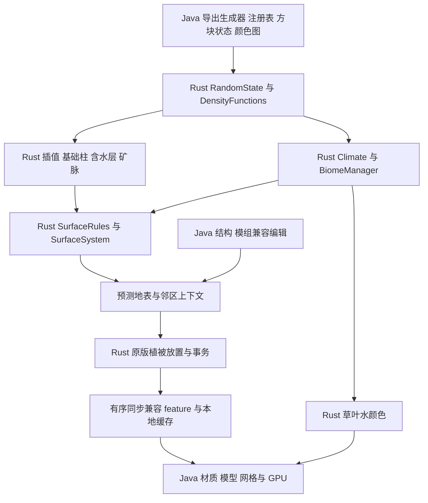

# Minecraft 1.21.1 原版流程与 Rust 实现

实现依据是项目映射后的 Minecraft 1.21.1 方法、实际注册表和数据包。
测试直接调用原版 Java 类；用户存档采集只用于补充回归。

## 当前调用链

| 原版职责 | Rust 文件 | 已实现与边界 |
| --- | --- | --- |
| RandomSource / WorldgenRandom | random.rs | 溢出、随机消耗、seed 派生和 Gaussian 缓存；Gaussian 单独记录平台舍入误差 |
| Improved/Perlin/Normal/BlendedNoise | noise.rs、blended_noise.rs | 依据原版 octave 顺序、名称派生、wrap 与混合规则 |
| DensityFunctions / NoiseChunk | density.rs | 完整 vanilla graph、f32 spline、中间缓存与 Raw/Single/Block/Cell 上下文 |
| MultiNoiseBiomeSource / Climate | climate.rs | 参数树与原版搜索语义；固定和其他受支持原版 biome source |
| getBaseColumn / Aquifer / OreVeinifier | terrain.rs | 完整高度范围内方块与液体采样；不以海平面常量代替含水层 |
| Beardifier | beard.rs | 各 adjustment、kernel、piece 与 junction 数值；需要显式结构上下文，生产自动发现尚未接入 |
| SurfaceRules / SurfaceSystem | surface.rs | 条件树、地表深度、陡坡、彩陶、坏地侵蚀、冰山；保留 X→Z 顺序 |
| Biome / BiomeManager | biome.rs | 三维位置 zoom、温湿度、颜色图、override 和沼泽/黑森林修饰；支持颜色图热更新 |
| FeatureSorter | decoration.rs | 按 possibleBiomes 原始顺序拓扑排序、全局索引、循环检测 |
| PlacedFeature / providers | vegetation.rs、providers.rs | 惰性 placement、装饰随机序列、biome 检查、状态提供器 |
| Trunk/Foliage/RootPlacer | vegetation/ | 普通与大型树、深色橡树、樱花、红树林根、附着物；完整方块属性 |
| 草、花、竹子与树附属物 | vegetation.rs、vegetation/decorators.rs | patches、噪声花卉、竹子叶型/年龄/阶段、藤蔓、可可、地面与蜂巢 |
| AbstractHugeMushroomFeature | vegetation/mushroom.rs | 红/棕色巨型蘑菇、有效空间检查、菌盖方向属性和菌柄；供黑森林与蘑菇岛选择链原生执行 |
| 树苗生存与 StructureTemplate.updateShapeAtEdge | vegetation.rs、vegetation/shape.rs | 原版轴顺序更新两侧方块；支撑面来自运行时状态数据，藤蔓、地毯、胎生苗、双层植物等在 Rust 更新 |

## 精确 API 与预测输出的区别

基础整柱与 `surfaceRegion` 返回对应生成阶段的数据，不是经过所有 chunk
status 后的最终世界。当前生产上下文沿用只显示地表的预测设计：读取 5×5
区块，允许写入中心 3×3 区块；植被拥有连续地面/水/高度查询。Java 村庄
模板、道路、农田、空气切除和灌溉水在植被之前同步，兼容 feature 按相同
全局索引交替执行。原生失败会回滚方块、世界随机流与独立装饰随机流。

原版完整区块还包含结构起点/引用、jigsaw、Beardifier 上下文、carvers 和
其他 decoration steps。这些尚未全部迁入本次生产管线，不能把基础柱或
单个 feature 通过当作完整村庄/森林与原版逐块一致。

远处稀疏列与完整地表块使用相同规则。稀疏计算检查西/北前驱列的规则是否可能移除顶层而改变 WORLD_SURFACE_WG
高度；可能改变高度时退回完整区块。实体替换成水不会改变此高度，不再
触发整区块回退。前驱列的坏地/冰山几何和实际顶层生物群系都参与判断。
近处与远处返回同一材质语义，颜色通过独立的三维坐标接口获取。

## 两处原版细节

1. `CherryFoliagePlacer.CODEC` 的 `corner_hole_chance` getter 错读了
   `wideBottomLayerHoleChance`。服务端快照导出时读取实际字段修正，不用
   JSON 中的错误值去覆盖原版运行值。目前修正已覆盖注册表中的顶层树配置；
   任意模组内嵌的特殊树配置仍需独立覆盖。
2. `BeehiveDecorator` 使用 `Collections.shuffle`，它的熵与世界 seed 分离。
   Java 为预测任务提供独立随机输入，Rust 执行候选排序、打乱和蜂巢放置。
   测试控制这份输入再调用原版对照。LOD 上下文没有 live block entity，
   因此遵循原版 Optional 为空时不生成蜜蜂实体的行为。

## 验证与平台

详见 README 的当前测试矩阵及 build 日志。Windows x86_64 的 Rust/JNI、
生产适配器与 GPU 回归在本机运行；Linux/macOS/ARM 尚未构建执行新库。
旧库是兼容后端，不是算法正确性的依据。未对游戏实测 FPS 作提升承诺。
